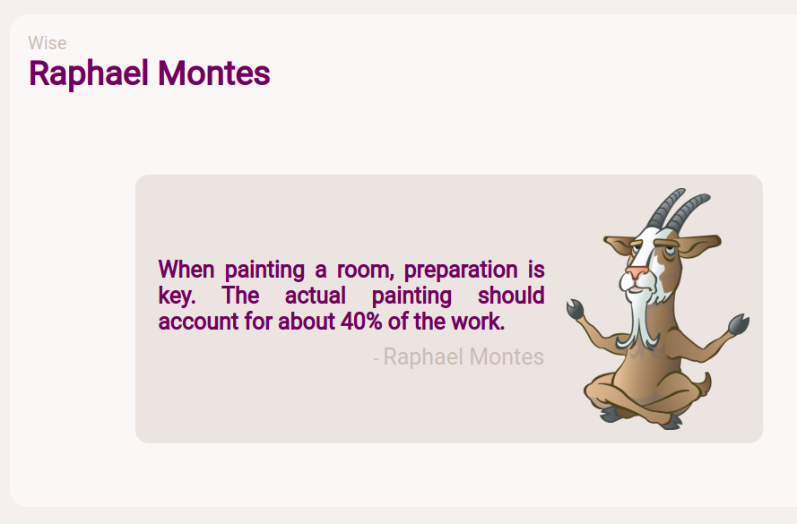

# Pedir Conselho
Pagina para exiber um conselho aleatório consumindo de uma API

### API
 - https://api.adviceslip.com/advice
 ```js
 ### Uso
 const API = '{API_URL}' // https://api.adviceslip.com/advice;
 
 fetch(API, {
            method: 'GET'
        })
        .then(resp => resp.json())
        .then(resp => resp.slip.advice)
        .then(setDataRef);
 ```
 ### Method "setDataRef"
 ```js
 const setDataRef = (text) => {
    document.querySelector("[data-ref]").innerHTML = text;
 }
 ```

## Ressalto
Tanto as frases, como os autores são mera inlustração, pois não se trata de sua autoria.

Os Autors são dados mocados da variável `autors` e usa-se um random para pega um autor aleatorio a cada atualização da pagina.

### Autors
```js
let autors = ["Graciliano Ramos", "Mario Quintana", [...] , "Daniel Galera"]
```

### Random Autors
```js
[...]

const randoAutors = () => {
    const size = autors.length;
    let num = Math.floor((Math.random() * size) + 1)
    document.querySelectorAll("[goat]").forEach(e => e.innerHTML = autors[num])
}

[...]
```
# Demo


# Page
[Demo page aqui](https://leltonborges.github.io/perdir-conselho/)
